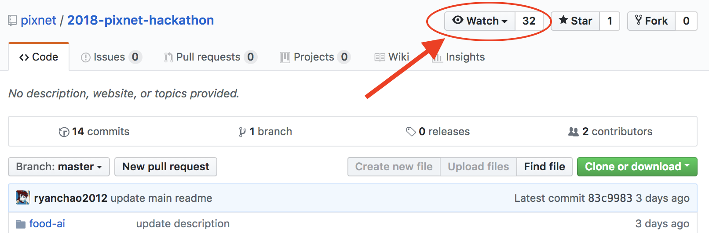

### 關注以獲取更新訊息 [更新紀錄](./CHANGELOG.md)

<h1 align="center">第五屆 PIXNET HACKATHON</h1>
<h3 align="center">打造智慧生活共榮圈</h3>
<h3 align="center">2018/8/18 (六) ~ 2018/8/19（日)</h3>

AI 人工智慧和物聯網技術 遇上生活真實數據 將激發多少創新應用 歡迎各界駭客高手前來挑戰 攜手打造智慧生活共榮圈

<h3 align="center"><a href="https://pixnet.kktix.cc/events/pixnethackthon2018">報名頁面</a></h3>

## 活動簡介

PIXNET 秉持 Open Data 精神，從2014年起每年持續舉辦 PIXNET HACKATHON，開放旗下「痞客邦」網站去識別化、社群巨量資料，旨在創造更多智慧的生活應用。2018年第五屆 PIXNET HACKATHON，擴大活動規模為兩天一夜，並與「台灣人工智慧實驗室 AILabs.tw」、「臺北智慧城市專案辦公室」等機構合作，期待透過產官學資源及技術交流，激盪出更多創意發想、可行方案。歡迎各界優秀技術團隊前來挑戰，創造科技更大應用價值，「智慧生活共榮圈」由你實現！

## 你應該參加的理由

### 多元資料及技術支援
本屆除了痞客邦數據資料，並由「台灣人工智慧實驗室 AILabs.tw」提供語音技術支援，「臺北智慧城市專案辦公室」協助媒合單位機構提供交通數據資料，作為本屆賽事的強力後盾。

### 駭客高手展現舞台
本屆賽事與「臺北智慧城市專案辦公室」合作，優秀團隊將有機會獲得後續合作洽談，或者 PIXNET 工作機會，讓技術成果發揮更大價值！

### 生動競賽方式
「IoT 語音情境應用」參賽隊伍於現場完整demo作品應用情境，真實展現技術力！「AI 智慧影像生成」參賽隊伍，除了競逐「評審獎」，本屆 PIXNET HACKATHON 特別規劃現場即時投票競賽，邀集全場參與，投票結果將決定哪一隊伍可抱走「票選獎」！

### 物聯網開發包
「IoT 語音情境應用」類別之錄取參賽隊伍，每隊於參賽前可獲得一套物聯網開發包，助你一臂之力！(領取時需繳交保證金，完賽當天將全額退還)

### 技術交流工作坊
賽前將舉辦兩場工作坊，由專業講師傳授 IoT 軟硬整合、影像及語音識別技術，歡迎有意參賽者免費報名參加！（詳細資訊將公布於「痞客邦機器人」 FB 粉絲團）

## 活動資訊

* 活動時間：2018/8/18 (六) ~ 2018/8/19 (日)  
* 活動地點：臺大綜合體育館 B1 (台北市大安區羅斯福路四段1號)
* 錄取參賽名額：200人
* 參賽費用：免費
* 活動現場提供：無線網路、電源插座、餐飲及零食、本屆賽事專屬紀念品。
* 活動自備物品：筆電、環保餐具、Mac筆電投影轉接頭、有線網路轉接器（以備不時之需）。活動為兩天一夜，現場規劃有過夜休息區，參賽者可自行攜帶個人睡袋、寢具等。
* 活動洽詢：敬請來信 pixnethacker@pixnet.tw 

## 報名及錄取時程

第一階段報名：即日起～ 2018/7/20 (五)

第一階段錄取：2018/7/20（五）寄送第一階段審核結果通知信。

第二階段報名：將視整體報名狀況，決定是否開放第二階段報名。

## 參賽主題及獎項​

[**IoT 語音情境應用**](./smart-iot)
[**AI 智慧影像生成**](./food-ai)

## 參賽辦法

* 主辦單位保留參賽資格審查權利，於 KKTIX 平台報名後，收到 PIXNET 所寄發之錄取通知方具本屆參賽資格。
* 請自行組隊，每隊伍限制人數 3~6人。每位參賽者需個別報名，填寫個人報名資料。
* 每隊需在主辦單位所指定時間內，運用主辦單位所提供之 API、Open Data 等工具，設計出可執行之程式雛形，若為「IoT 語音情境應用」參賽隊伍則需使用主辦單位提供之物聯網開發包。參賽隊伍可依開發需求自行加入其他類型之 Open Data 資料。
* 「IoT 語音情境應用」參賽隊伍於賽前領取開發包時，須繳交新台幣1500元作為保證金，保證金將於完賽當天全額退回。
* 各隊需於活動當天進行現場提案，並且展示初步成果。
* 參賽隊伍於賽事當天需提供作品簡報與連結。
* 各隊需使用主辦單位所提供之 API 以及資料數據，若違反規則，將不具獲獎資格。
* 得獎隊伍獎金為現場領取，請參賽者攜帶個人身分證，以便完成獎金領取手續。

## 注意事項

1. 參加者於參加本活動之同時，即同意接受本活動之活動辦法與注意事項之規範，如有違反，主/協辦單位得取消其參加或得獎資格，並就因此所生之損害，得向參加者請求損害賠償。

2. 參賽隊伍於報名截止後，不得再變更參賽組別、團隊成員名單及人數，若有違反者，將視同放棄參加此次活動。

3. 參賽隊伍所提供之隊伍資訊（包括但不限於隊伍名稱等）、作品題目與內容，不得侵害他人之智慧財產權或其他權利，同時不可涉及廣告、宗教、種族、政黨、暴力或違反社會善良風俗、公共秩序等。

4. 採用不正當之行為（如：侵入資料庫、改封包，及其它經主辦單位認定之駭客行為等）、竄改票數或給予票數者，主辦單位有權終止參賽資格或取消得獎資格，且主辦單位不因此承擔任何責任。

5. 本活動若徵求參加者提供圖文、照片、影片及其他資料等內容予主/協辦單位，參加者同意下列事項：

	a. 參加者保證提供予本活動之圖文、照片、影片及其他資料，並無侵害他人權利（包括但不限於智慧財產權、人格權、肖像權及隱私權等）或違反法令之情事。如有違反之虞，主/協辦單位得立即移除相關內容，並取消參加者之參加資格，得獎者取消得獎資格，參加者並應自負法律責任。

	b. 若主/協辦單位因使用參加者所提供之圖文、照片、影片及其他資料遭第三人請求、索賠、提出民、刑事訴訟或主張任何法律上之權利，參加者應賠償 主/協辦單位因此所生之全部損失與費用(包括但不限於訴訟費、律師費)。

	c. 主/協辦單位對參加者所提供之圖文、照片、影片及其他資料有審查權，若不符合本活動之規定，經查證屬實，得取消其參加與得獎資格。

	d. 參加者同意授權主/協辦單位於符合本活動目的的情形下，使用及節錄其為參加本活動所提供之圖文、照片、影片及其他資料，做成活動記錄以及宣傳使用。

6. 凡經報名參賽，參加者即同意主辦單位得為紀錄、宣傳推廣或其他與本活動相關之目的而使用參賽隊伍之作品及參加者相關資料（包括但不限於參加者之姓名、肖像等），主辦單位無須另行通知參加者或支付任何權利金。如涉及作品內容完整呈現者，主辦單位於使用時應註明參賽隊伍名稱或其成員姓名。

7. 各隊作品之智慧財產權屬參賽隊伍之成員所有，參賽隊伍應自行處理與其權利相關之申請或註冊程序。

8. 如有任何因電腦、網路、電話、技術或不可歸責於主/協辦單位之事由，而使參加者所寄出或登錄之資料有遲延、遺失、錯誤、無法辨識或毀損之情況，主/協辦單位不負任何法律責任，參加者亦不得因此異議或要求主辦單位賠償損害。

9. 主辦單位保有更改活動形式、提供資料內容以及活動相關細節的權利。如因不可抗力之特殊原因無法執行時，主辦單位有權決定取消、終止、修改或暫停本活動。

10. 若使用PIXNET API，皆需遵守[PIXNET API 使用條款](http://developer.pixnet.pro/#!/doc/pixnetApiTos/pixnetApiTos)。

11. 本活動所提供之贈品、獎狀、獎盃等活動相關製作物，主辦單位恕不負保管及重新製作之責任。

12. 依稅法規定，得獎者若為中華民國境內居住之個人，所得獎項價值超過新臺幣1,000元（含）以上20,000元以下時，本公司將開立所得稅扣繳憑單予得獎者，如所得獎項價值為20,000元(含)以上時，得獎者需先繳交 10% 預扣所得稅金，始可領獎，本公司亦將開立所得稅扣繳憑單予得獎者。得獎者若為非中華民國境內居住之個人(即在中華民國境內居住未達183天之本國人及外國人)，不論得獎獎項價值，均須先就得獎所得扣繳20％預扣所得稅金，始可領獎，且本公司須開立所得稅扣繳憑單。若未能依法繳納應繳稅額，即視為喪失得獎資格。

13. 為確保獎項發送程序，參賽者應確認登錄資料均為正確完整，如因資料不完全、冒用他人身分或其他違反本活動報名規定事項者，本公司得取消參賽者之參賽資格或得獎資格，參賽者不得異議。

14. 個資法條款：

	a. 為提供本活動相關服務，並確保參賽者權益，將遵循個人資料保護法及相關法令之規定，蒐集、處理及利用參賽者所提供之個人資料，包括 E-mail、姓名、性別、出生年月日、身分證字號、服務機構、通訊住址、電話等資訊。

	b. 參賽者就其個人資料得依個人資料保護法第三條之規定，行使：查詢或請求閱覽、請求製給複製本、補充或更正、停止蒐集、處理、利用與刪除等權利。

	c. 參賽者得自由選擇是否提供個人資料或行使個人資料保護法第三條所定之權利，但如提供資料不足或有其他冒用、盜用、不實之情形，參賽者可能因此無法參加本活動及影響各項相關服務或權益。

	d. 參賽者就其個人資料依個人資料保護法第三條之規定，請求停止蒐集、處理或利用或請求刪除前，主辦單位得依循個人資料保護法及相關法令之規定，於個人資料提供之範圍與目的內使用該等個人資料。

<h3 align="center"><a href="https://pixnet.kktix.cc/events/pixnethackthon2018">報名頁面</a></h3>
