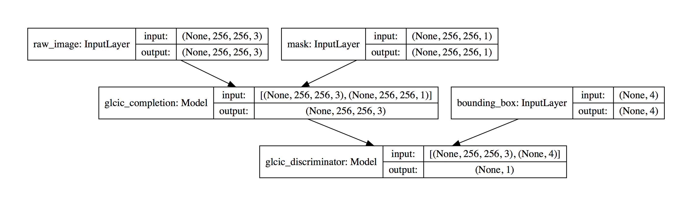

# PIXCHEF
This is a demo implementation of "**Globally and Locally Consistent Image Completion**".

### Quick Start
ℹ️ We arranged all scripts to be executed as module, so the working directory for commands should be the parent directory of this folder(pixchef), i.e.:

```
$ pwd
/Users/ryanchao2012/Desktop/projects/2018-pixnet-hackathon/demos/pixchef

$ cd ..

$ pwd
/Users/ryanchao2012/Desktop/projects/2018-pixnet-hackathon/demos

$ python -m pixchef.models
```

1. To get the summaries/visuilizations of the models, run:

    `python -m pixchef.models`

    The results will be stored in `graphs/`.

2. Place your data in `data/` folder, and start training the model:

    `python -m pixchef.training`

    evaluation results will be placed in `evaluate/` folder.

3. `test_models.py` will output image processing results from some stages(layers) in the model pipeline for debugging purpose and giving some intuition.

    `python -m pixchef.test_models`

    results will be placed in `temp/` folder.

### Requirements for Python

```
$ pip install -r requirements.txt
```

You may need [`graphviz`](https://www.graphviz.org/download/) to make `pydot` work functionally.


### Model Architecture


### Overall Graph Visualization



## Reference
* [Globally and Locally Consistent Image Completion](http://hi.cs.waseda.ac.jp/~iizuka/projects/completion/en/)
