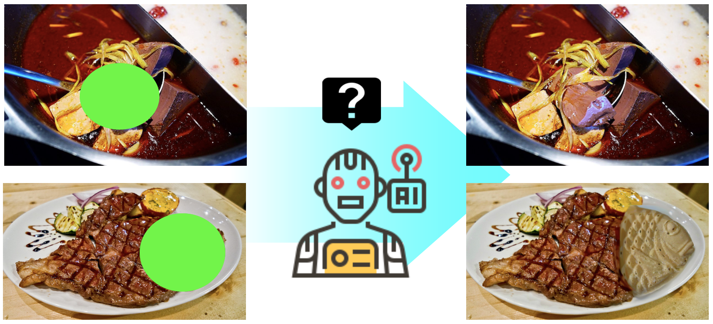

# PIXNET AI智慧影像生成

台灣美食享譽世界，痞客邦上有全台最豐富的美食紀錄，早餐、午餐、晚餐外加宵夜，每一天，上千萬的使用者來這裡找尋下一餐的靈感，你想好要吃什麼了嗎 : )

如果機器能夠像美食部落客一樣專業，那麼機器會如何理解美食呢？ AI 能夠計算出好吃的牛排該長什麼樣子？ 又或者麻辣火鍋裡該加什麼料呢？



本競賽參賽者將利用**影像檢索**與**深度學習**的相關技術，想辦法**從影像中找回遺失的食材，還原食物的美味。**


參賽者拿到的題目範例將如下所示：

```
這顆草莓瑞士捲，草莓沾著奶油吃起來香濃滑口，酸酸甜甜，搭配巧克力蛋糕，滋味絕妙。
```


### 題目內容包含：

1. 一段圖片中食物的文字描述。
2. 一張局部挖空的食物圖片，並附上挖空位置的bounding box資訊(示意圖，非顯示在原始圖片中)。
3. 比賽圖片尺寸統一為 **`256 x 256`**，格式為 `JPG`。
4. 挖空 bounding box 最大邊長不會超過 `128`。

### 比賽答題流程示意：


1. 參賽者透過 API 向主辦方索取題目。
2. 參賽者設計算法預測並還原影像。
3. 參賽者將還原之影像透過 API 上傳主辦方。
詳細的比賽流程請參考[比賽方式](#how-to-battle)

## 題庫


#### 痞客邦美食資料集：PIXFOOD20 (預計6/15開放)

**PIXFOOD20** 是痞客邦精選 **20** 個種類的美食圖庫，少數圖片可能帶有多個分類標籤，分類包含：

```
火鍋、牛排、咖啡、丼飯、滷肉飯、
生魚片、鬆餅、麵包、蛋糕、義大利麵、
牛肉麵、小籠包、生菜沙拉、拉麵、串燒、
壽司、漢堡、薯條、冰淇淋、手搖飲料
```

**PIXFOOD20** 將被切分為**訓練集**(Training set)與**測試集**(Testing set)，訓練集開放給所有參賽者下載，用來訓練深度學習的模型，**實際比賽題目將由測試集抽出**。


## 輔助資料集

#### 痞客邦文章資料集：

含有原始 html 的熱門文章資料，參賽者可以透過此資料集了解圖文間的上下文關係，資料範例如下：

```
{
  "url": "http://phina66.pixnet.net/blog/post/55377582",
  "site_category": "美味食記",
  "custom_category": "美式餐廳",
  "title": "(3)台北中山區。GAUCHO(高卓人)~阿根廷炭烤餐廳，大口吃肉吃到怕!",
  "tags": [
    "烤肉",
    "majimaji",
  ],
  "body": "<table id=\"table1\" style=\"margin: 0 ...略... </small>&nbsp;</p>",
  "images": [
    "http://pic.pimg.tw/phina66/1388908473-3616148299_l.jpg",
    "http://pic.pimg.tw/phina66/1388908582-2565883661_l.jpg",
    "http://pic.pimg.tw/phina66/1389535107-1865653827.jpg?v=1389535242"
  ],
  "keywords": [
    "阿根廷烤肉台北"
  ]
}

```

#### 外部資料集：
參賽者可以使用額外的資料集輔助模型訓練，例如以下：

* [Food-101 Dataset](https://www.vision.ee.ethz.ch/datasets_extra/food-101/)
* [UECFOOD-100 Dataset](http://foodcam.mobi/dataset100.html)


## 競賽平台: 痞客邦神廚鬥味場
競賽平台預計於 **`7/30`** 對外開放給參賽者測試使用，請參賽者密切注意。

### 平台註冊與登入

1. 每一組參賽隊伍必須在 **PIXNET** 平台註冊一組帳號，驗證通過後即可使用此帳號登入本平台。
2. 每組通過報名審核之參賽隊伍，將分配一組 API Token，作為接收題目與上傳答案的身份驗證，請妥善保管好自己的 API Token。

---
<a name="how-to-battle"></a>
### 比賽方式
(`#TODO: 平台示意圖待補`)

1. 比賽以 **回合制** 進行，無分初/決賽，一共 `20` 個回合，總計 `20` 張圖片。
2. 每一回合競賽平台會更新一組題目，並呈現在頁面上。
3. 題目由一段`文字描述`與`缺空的食物圖片`組成，圖片尺寸固定為 **`256 x 256`**，並被包裝成`JSON`格式如下：

	```
	{
		quiz_id: "q12",
		bounding_box: {
			"x": 160,
			"y": 120,
			"w": 80,
			"h": 40
		}
		description: "這顆草莓瑞士捲，草莓沾著奶油吃起來香濃滑口，酸酸甜甜，搭配巧克力蛋糕，滋味絕妙。",
		image_b64: "/9j/4AAQSkZJRgABAQAASABIAAD...(略)"
	}
	```
	
4. 當題目公布，參賽隊伍須 **主動** 透過平台 API，下載題目進行分析並生成完整影像。
5. 自題目公布開始，參賽隊有 **1分鐘** 的時間，將生成之影像，透過 API 傳送回競賽平台，成品將即時呈現於畫面上。
6. 所有上傳之影像，開放給現場觀眾投票，每回合觀眾將有 **3分鐘** 進行投票，詳細說請參考 [投票機制](#how-to-poll)。
7. 進行下一回合出題。


---
### 獎項與評分機制
本競賽將提供兩個獎項：

#### 🏆評審獎
* 演算法設計 40%
	* 使用何種模型架構
	* 如何處理資料 pipeline
	* 如何評估算法 performance
* 影像成果 40%
	* 生成之影像能夠產生多少細節。
	* 生成之內容符合原始圖片的場景。

* 簡報說明 20%
	* 論述應掌握重點，表達清晰，條理分明。

#### 🏆人氣獎
由現場觀眾投出總計最高票之隊伍獲得。
<a name="how-to-poll"></a>
投票機制：

1. 每張由參賽者產生的圖片上會有三個可點選的按鈕，👍、🤤、💩，觀眾可任意點選。
2. 平台將統計每隊所得 👍 總數，作為得獎依據，其他按鈕不予計分。


---
### API說明
.


## 參考閱讀
* [Globally and Locally Consistent Image Completion](http://hi.cs.waseda.ac.jp/~iizuka/projects/completion/en/)
* [Image Inpainting for Irregular Holes Using Partial Convolutions](https://arxiv.org/abs/1804.07723)
